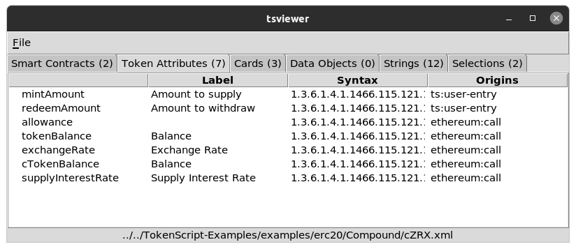

# TokenScript Visualiser

You can use the TokenScript Viewer to see the major parts in a TokenScript file.

Here is the instruction:

1. Check your dependency. On OS X everything needed is shipped. On Ubuntu, you need to install 3 packages: tcl, tk, tdom at the outset.

2. Clone it to get the source code:

$ git clone https://github.com/AlphaWallet/TokenScript-Viewer

3. Go to src directory and run ./tsviewer.tcl

$ cd src
src$ ./tsviewer.tcl

You should see a new window, use "File -> Open" to open a tokenscript file (signed or unsigned doesn't matter). You will get something like this:

